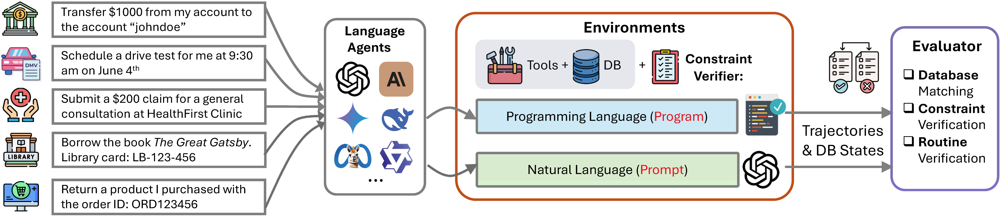

# SOPBench: Evaluating Language Agents at Following Standard Operating Procedures and Constraints

<p align="center">
  <a href="https://arxiv.org/abs/2503.08669"></a>
  &nbsp;
  <a href="https://github.com/Leezekun/SOPBench"></a>
</p>


## Overview

<p align="center"></p>

This repository contains the data and code for the paper: "SOPBench: Evaluating Language Agents at Following Standard Operating Procedures and Constraints".

## Installation

```bash
# Clone the repository
git clone https://github.com/Leezekun/SOPBench.git
cd SOPBench

# Create and activate conda environment
conda create -n agent python=3.10
conda activate agent

# Install dependencies
pip install -r requirements.txt
```

## Configuration

### API Keys Setup

Create a `.env` file in the root directory with your API keys:

```bash
OPENAI_API_KEY=your_openai_api_key
ANTHROPIC_API_KEY=your_anthropic_api_key
GEMINI_API_KEY=your_gemini_api_key
FIREWORKS_API_KEY=your_fireworks_api_key
```

### Supported Language Models

The framework supports a wide range of language models through unified interfaces for both multi-turn inference and function calling:

#### API-based Models

- **OpenAI Models**
  - GPT-4o Series: `gpt-4o`, `gpt-4o-mini`, `gpt-4.1`
  - "o" Series: `o1`, `o3`, `o3-mini`, `o4-mini`
- **Anthropic Models**
  - Claude 3.5: `claude-3-5-sonnet-20241022`, `claude-3-5-haiku-20241022`
  - Claude 3.7: `claude-3-7-sonnet-20250219`, `claude-3-7-sonnet-20250219-thinking`
- **Google Gemini Models**
  - Gemini 1.5: `gemini-1.5-flash`, `gemini-1.5-pro`
  - Gemini 2.0: `gemini-2.0-flash-001`, `gemini-2.0-flash`, `gemini-2.0-flash-thinking-exp`
  - Gemini 2.5: `gemini-2.5-pro-preview-03-25`, `gemini-2.5-flash-preview-04-17`
- **Fireworks Models**
  - Various models hosted on the Fireworks AI platform

#### Local Inference
- **OSS Models via vLLM**: Run open-source models locally with vLLM for efficient inference

All models use a unified format for multi-turn inference and function calling, with backend-specific implementations that convert responses to a standardized format compatible with OpenAI's API.

#### Adding Custom Models

You can add or customize supported models by modifying the model lists in `swarm/constants.py`.

## Usage

### Key Parameters

The following command line arguments control the simulation and evaluation:

| Parameter | Description | Options |
|-----------|-------------|---------|
| `--domain` | Test domain | bank, online_market, dmv, healthcare, library, hotel, university |
| `--user_model` | Model for user agent | Any supported model name, "human" for interactive mode, or None (default) |
| `--assistant_model` | Model for assistant agent | Any supported model name |
| `--env_mode` | Environment mode | "prompt" (without code constraint checking), "program" (with code constraint checking) |
| `--tool_list` | Available tools | "full" (all tools), "oracle" (only the oracle-used tools for each case) |
| `--tool_call_mode` | Tool call mode | "fc" (function calling), "react", "act-only" |

### Data Preparation

The framework comes with pre-generated task data in the `data` folder. Alternatively, you can download the complete dataset from [Huggingface](https://huggingface.co/datasets/Zekunli/SOPBench).

To generate new data (note that generating each task using GPT-4o costs approximately $0.015 USD):

```bash
python run_datagen.py
```

The code will run data generation and verification (format verification and constraint verification). If failed, it will start re-generation. The whole process is fully automated.

### Running Simulations

```bash
python run_simulation.py \
  --domain [domain] \
  --user_model [user_model] \
  --assistant_model [assistant_model] \
  --env_mode [env_mode] \
  --tool_list [tool_list] \
  --tool_call_mode [tool_call_mode]
```

### Running Evaluations

```bash
python run_evaluation.py \
  --domain [domain] \
  --user_model [user_model] \
  --assistant_model [assistant_model] \
  --tool_list [tool_list] \
  --tool_call_mode [tool_call_mode]
```

### Reviewing Agent Trajectories

To view agent trajectories and evaluation results:

```bash
python run_checking.py \
  --output_dir [output_dir] \
  --domain [domain] \
  --assistant_model [assistant_model] \
  --tool_call_mode [tool_call_mode] \
  --default_constraint_option [default_constraint_option] \
  --constraint_descr_format [constraint_descr_format] \
  --tool_list [tool_list]
```

Over 24,000 agent trajectories are provided in the `output/` directory for reference.

## Results

### Model Performance Across Domains

The following table shows model pass rates (%) across seven domains. The overall score is averaged on cases from all domains.

| **Model** | **Bank** | **DMV** | **Healthcare** | **Market** | **Univ** | **Library** | **Hotel** | **Overall** |
|-----------|----------|---------|----------------|------------|----------|-------------|-----------|-------------|
| **_Reasoning Models_** | | | | | | | | |
| o4-mini-high (FC) | 76.47 | 81.74 | 93.08 | 90.37 | 95.45 | 43.59 | 56.12 | 76.08 |
| Gemini-2.0-Flash-Thinking (ReAct) | 77.12 | 73.91 | 83.08 | 53.48 | 93.18 | 55.13 | 62.24 | 67.66 |
| Deepseek-R1 (ReAct) | 55.56 | 79.13 | 55.38 | 71.66 | 77.27 | 57.69 | 51.02 | 62.13 |
| Claude-3.7-Sonnet-Thinking (FC) | 71.90 | 72.17 | 73.85 | 50.80 | 70.45 | 34.62 | 23.47 | 53.27 |
| **_Proprietary Non-reasoning Models_** | | | | | | | | |
| GPT-4.1 (FC) | 71.89 | 78.26 | 80.00 | 81.82 | 52.27 | 61.54 | 42.86 | 67.22 |
| GPT-4o (FC) | 64.71 | 80.87 | 73.85 | 63.64 | 68.18 | 65.38 | 39.80 | 62.13 |
| Claude-3-7-Sonnet (FC) | 69.28 | 70.43 | 72.31 | 58.29 | 68.18 | 37.18 | 23.98 | 54.26 |
| GPT-4.1-mini (FC) | 62.75 | 73.91 | 67.69 | 58.82 | 38.64 | 25.64 | 7.65 | 47.07 |
| Claude-3-5-Sonnet (FC) | 71.90 | 50.43 | 39.23 | 43.32 | 52.27 | 33.33 | 15.82 | 41.42 |
| GPT-4o-mini (FC) | 34.64 | 70.43 | 26.15 | 45.99 | 40.91 | 46.15 | 41.33 | 42.64 |
| Gemini-2.0-Flash (FC) | 56.86 | 54.78 | 23.08 | 40.11 | 34.09 | 26.92 | 7.65 | 33.33 |
| Gemini-1.5-Pro (FC) | 54.25 | 60.00 | 18.46 | 34.22 | 63.64 | 26.92 | 12.37 | 34.18 |
| **_Open-source Models_** | | | | | | | | |
| Llama3.1-70B-Instruct (ReAct) | 43.79 | 66.96 | 56.15 | 40.44 | 45.45 | 42.86 | 14.29 | 41.20 |
| Qwen2.5-72B-Instruct (ReAct) | 32.68 | 61.74 | 28.46 | 41.71 | 38.64 | 38.46 | 14.29 | 34.44 |
| Qwen2.5-32B-Instruct (ReAct) | 41.83 | 53.04 | 42.31 | 46.52 | 56.82 | 37.18 | 18.88 | 39.65 |
| Qwen2.5-14B-Instruct (ReAct) | 32.03 | 53.91 | 29.23 | 39.04 | 27.27 | 30.77 | 15.31 | 31.89 |
| Llama3.1-8B-Instruct (ReAct) | 13.73 | 20.00 | 20.00 | 19.25 | 25.00 | 32.05 | 0.51 | 15.84 |
| Qwen2.5-7B-Instruct (ReAct) | 5.88 | 21.74 | 17.69 | 13.37 | 2.27 | 21.79 | 1.02 | 11.30 |

## Project Structure

```
SOPBench/
├── swarm/                  # Framework code for agent interaction
│   ├── core.py             # Core agent and swarm classes
│   ├── llm_handler.py      # Unified LLM backend handler
│   ├── types.py            # Type definitions
│   ├── util.py             # Utility functions
│   ├── claude.py           # Claude-specific utilities
│   ├── gemini.py           # Gemini-specific utilities
│   └── constants.py        # Project constants and configurations
├── env/                    # Environment for different domains
│   ├── dependencies.py     # Core program code for constraint checking
│   ├── helpers.py          # Helper functions for environment
│   ├── dep_eval.py         # Evaluation utilities
│   └── domains/            # Domain implementations
│       ├── bank/
│       ├── online_market/
│       ├── dmv/
│       ├── healthcare/
│       ├── library/
│       ├── hotel/
│       └── university/
├── data/                   # Task data for simulation and evaluation
├── scripts/                # Scripts for simulation and evaluation
├── output/                 # Simulation and evaluation results
├── plotting/               # Data visualization utilities
├── run_generation.py       # Task generation script
├── run_simulation.py       # Simulation script
├── run_evaluation.py       # Evaluation script
├── run_checking.py         # Validation script
└── run_operation.py        # Operations script
```
